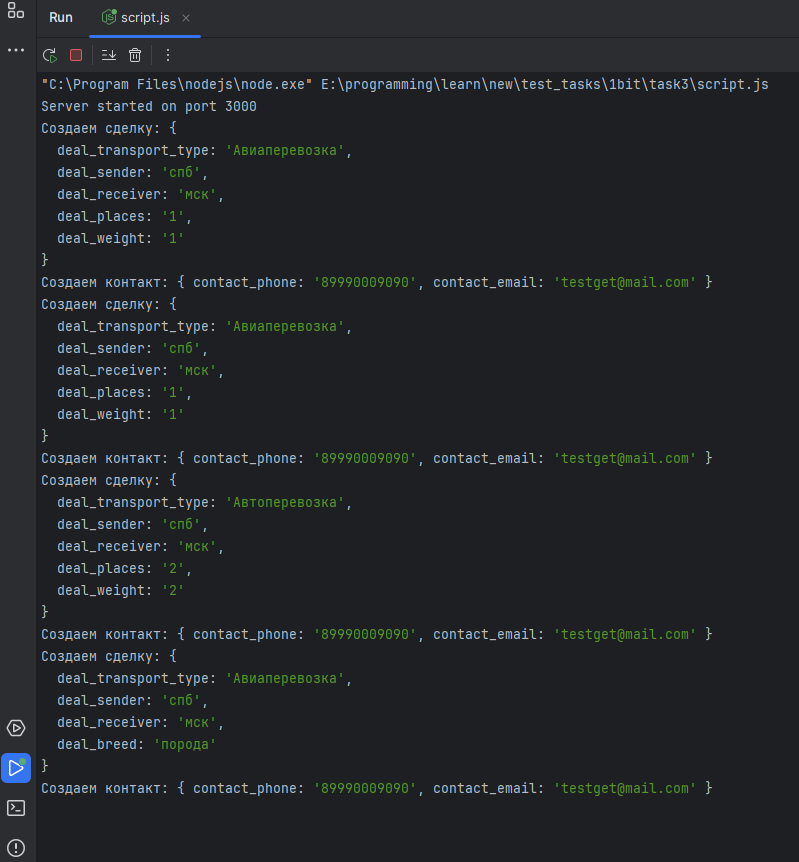

# Тестовое задание №3 (Реализация интеграции сайта с amoCRM)

## Вводные данные:
У клиента есть сайт, на котором имеются 4 формы, необходимо на базе тестового проекта на amocore создать контроллер, который будет обрабатывать данные которые будут поступать на данную url.

### Список форм: 
```
Array(
[vidperevozki] => Авиаперевозка [forma] => Общая [Zayavka na perevozku iz] => спб в мск [otkuda] => спб [kuda] => мск [kolichestvo mest] => 1
[ves] => 1
[telefon] => 89990009090 [email] => testget@mail.com )
```


### Соотношение
```
[vidperevozki] - Сделка - Вид перевозки (ID кастомного поля)
[otkuda] - Сделка - Грузоотправитель (пункт отправления) (ID кастомного поля) [kuda] -Сделка - Грузополучатель (пункт получения) (ID кастомного поля) [kolichestvo mest] - Сделка - Кол-во мест (ID кастомного поля)
[ves] - Сделка - Вес (ID кастомного поля)
[telefon] - Контакт - Телефон (ID кастомного поля) [email] - Контакт - Email (ID кастомного поля)
```
```
Array(
[vidperevozki] => Авиаперевозка [forma] => Авиаперевозка [Zayavka na perevozku iz] => спб в мск [otkuda] => спб [kuda] => мск [kolichestvo mest] => 1
[ves] => 1
[telefon] => 89990009090 [email] => testget@mail.com 
)
```
```
 Array(
[vidperevozki] => Автоперевозка [forma] => Автоперевозка [Zayavka na perevozku iz] => спб в мск
[otkuda] => спб [kuda] => мск [kolichestvo mest] => 2 [ves] => 2
[telefon] => 89990009090 [email] => testget@mail.com 
)
```
```
 Array(
[vidperevozki] => Авиаперевозка [forma] => Перевозка животных [Zayavka na perevozku iz] => спб в мск [otkuda] => спб
[kuda] => мск [poroda] => порода
[telefon] => 89990009090 [email] => testget@mail.com 
)
```

## Результат
Так как про amocore информации не нашел, gitlab репозиторий пуст, а amocore.in недоступен, решил реализовать задачу на JavaScript

Были использованы:
* 1
* 2
* 3
* 4
* 5

### Форма 1: Общая
```
curl -X POST -d "vidperevozki=Авиаперевозка&forma=Общая&Zayavka%20na%20perevozku%20iz=спб%20в%20мск&otkuda=спб&kuda=мск&kolichestvo%20mest=1&ves=1&telefon=89990009090&email=testget@mail.com" http://localhost:3000/form-handler
```
### Форма 2: Авиаперевозка
```
curl -X POST -d "vidperevozki=Авиаперевозка&forma=Авиаперевозка&Zayavka%20na%20perevozku%20iz=спб%20в%20мск&otkuda=спб&kuda=мск&kolichestvo%20mest=1&ves=1&telefon=89990009090&email=testget@mail.com" http://localhost:3000/form-handler
```
### Форма 3: Автоперевозка
```
curl -X POST -d "vidperevozki=Автоперевозка&forma=Автоперевозка&Zayavka%20na%20perevozku%20iz=спб%20в%20мск&otkuda=спб&kuda=мск&kolichestvo%20mest=2&ves=2&telefon=89990009090&email=testget@mail.com" http://localhost:3000/form-handler
```
### Форма 4: Перевозка животных
```
curl -X POST -d "vidperevozki=Авиаперевозка&forma=Перевозка%20животных&Zayavka%20na%20perevozku%20iz=спб%20в%20мск&otkuda=спб&kuda=мск&poroda=порода&telefon=89990009090&email=testget@mail.com" http://localhost:3000/form-handler
```

